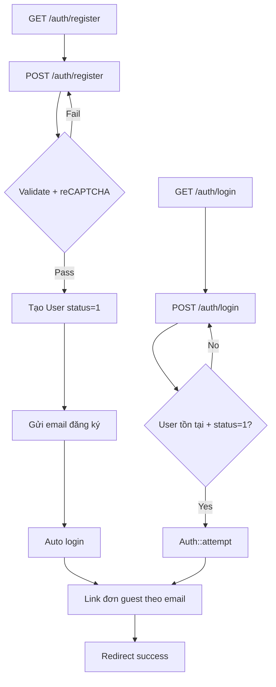
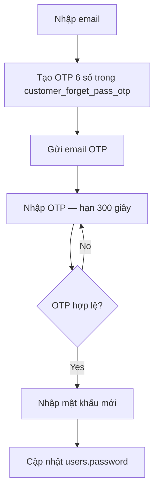
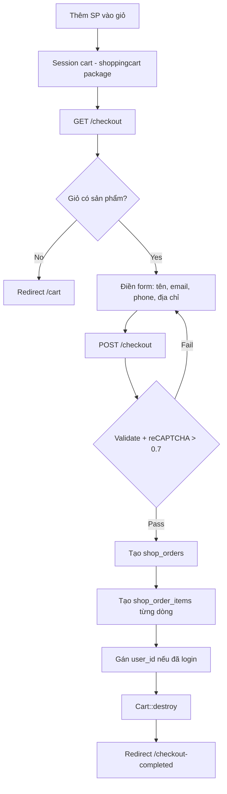
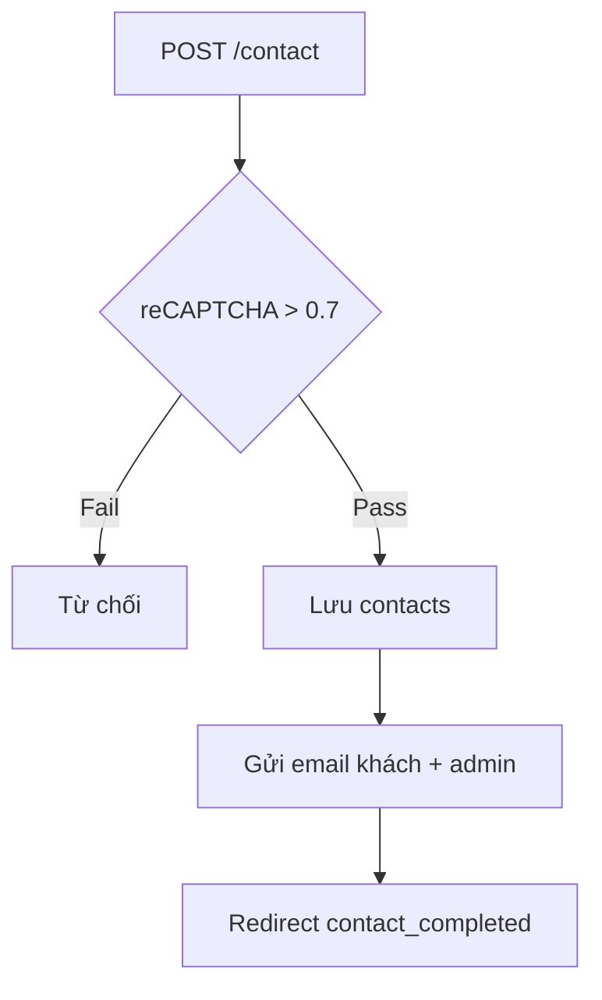
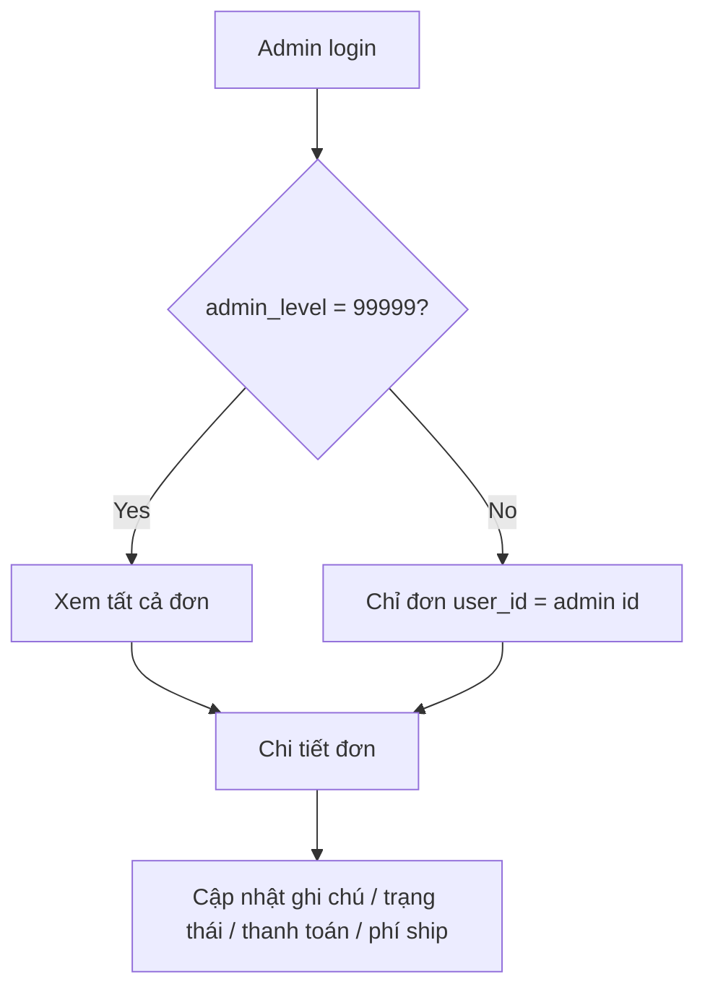
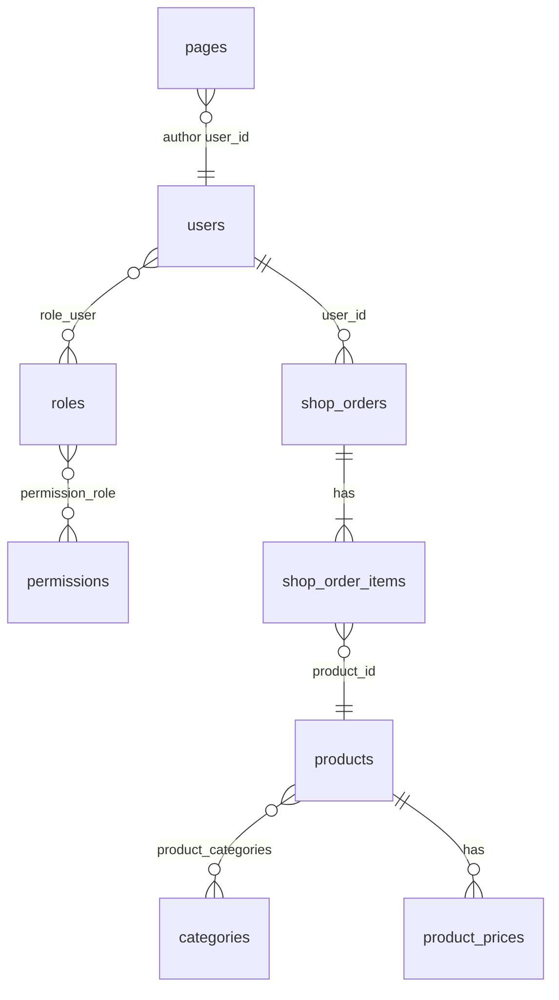

# MASTER — Vật Tư Nông Nghiệp 58

> **Tài liệu master** mô tả nghiệp vụ, luồng xử lý, logic, schema và toàn bộ tính năng người dùng.  
> Dùng làm **chuẩn tham chiếu** khi refactor / build lại dự án khác (vd. `3nong`).  
> **Cập nhật:** 2026-07-10 · Laravel **13** · PHP **8.3+**

**Tài liệu kỹ thuật chi tiết hơn:** [docs/PROJECT_ANALYSIS.md](docs/PROJECT_ANALYSIS.md) · [docs/TABLE_GLOSSARY.md](docs/TABLE_GLOSSARY.md) · [docs/ROUTE_GLOSSARY.md](docs/ROUTE_GLOSSARY.md) · [docs/REFACTOR_3NONG_PLAYBOOK.md](docs/REFACTOR_3NONG_PLAYBOOK.md) · [RECOMMENDATIONS.md](RECOMMENDATIONS.md)

---

## 1. Mục đích tài liệu

| Ai đọc                | Dùng để                                  |
| --------------------- | ---------------------------------------- |
| Developer / AI agent  | Hiểu hệ thống trước khi sửa code         |
| PM / BA               | Nắm phạm vi tính năng và luồng nghiệp vụ |
| Refactor sang `3nong` | So sánh gap, giữ đúng business rule      |

**Nguyên tắc:** Tài liệu này mô tả **hành vi thực tế trong code**, không phải ý tưởng ban đầu.

---

## 2. Tổng quan hệ thống

### 2.1. Loại ứng dụng

Website **thương mại điện tử + CMS** cho ngành nông nghiệp:

- Giới thiệu sản phẩm, danh mục, tin bài
- Giỏ hàng và đặt hàng (xác nhận thủ công / liên hệ)
- Tài khoản khách hàng (đăng ký, đăng nhập, xem đơn)
- Khu vực quản trị (CMS, đơn hàng, phân quyền)

### 2.2. Vai trò người dùng

| Vai trò            | Guard   | Bảng                | Mô tả                                                |
| ------------------ | ------- | ------------------- | ---------------------------------------------------- |
| **Khách vãng lai** | —       | —                   | Xem sản phẩm, thêm giỏ, đặt hàng không cần đăng nhập |
| **Khách hàng**     | `web`   | `users`             | Đăng ký/đăng nhập, quản lý profile, xem đơn của mình |
| **Quản trị viên**  | `admin` | `users` (cùng bảng) | CMS, đơn hàng, cấu hình — phân quyền theo role       |

> **Lưu ý quan trọng:** Khách và admin dùng **chung bảng `users`**, phân biệt bằng role / `admin_level`, không tách bảng.

### 2.3. Stack kỹ thuật (tóm tắt)

| Lớp           | Công nghệ                                                             |
| ------------- | --------------------------------------------------------------------- |
| Backend       | Laravel 13, Eloquent, Form Request                                    |
| Storefront    | Blade + Vite 7 + Tailwind CSS 4                                       |
| Storefront JS | axios qua `resources/js/http.js`, `auth-forms.js`, `window.AppRoutes` |
| Admin         | AdminLTE 4 + jQuery + axios (`js_admin.js`, `window.AdminRoutes`)     |
| Giỏ hàng      | `surfsidemedia/shoppingcart` (session)                                |
| Media admin   | CKFinder                                                              |
| Email         | Mailgun / SMTP qua `settings`                                         |

---

## 3. Bản đồ tính năng người dùng

### 3.1. Storefront (công khai)

| #   | Tính năng          | URL / Route name                               | Controller                        | Trạng thái                                    |
| --- | ------------------ | ---------------------------------------------- | --------------------------------- | --------------------------------------------- |
| 1   | Trang chủ          | `/` · `index`                                  | `PageController@index`            | **Active**                                    |
| 2   | Trang tĩnh CMS     | `/{slug}` · `page`                             | `PageController@page`             | **Active**                                    |
| 3   | Đổi ngôn ngữ       | `/lang/{locale}` · `change_language`           | Closure                           | **Active** (`vi`/`en`)                        |
| 4   | Danh sách sản phẩm | `/product` · `product`                         | `ProductController@index`         | **Active**                                    |
| 5   | Danh mục sản phẩm  | `/product/{slug}.html` · `product.category`    | `ProductController@index`         | **Active**                                    |
| 6   | Chi tiết sản phẩm  | `/product/{slug}-{id}.html` · `product.detail` | `ProductController@productDetail` | **Active**                                    |
| 7   | Quick view (AJAX)  | `POST /quick-view` · `shop.quickView`          | `ProductController@quickView`     | **Active**                                    |
| 8   | Mua ngay           | `/buy-now` · `shop.buyNow*`                    | `ProductController`               | **Active**                                    |
| 9   | Tin tức / bài viết | `/news` · `news`                               | `PostController@index`            | **Active**                                    |
| 10  | Chi tiết bài viết  | `/news/{slug}-{id}.html` · `news.detail`       | `PostController@show`             | **Active**                                    |
| 11  | Tìm kiếm           | `/search?keyword=` · `search`                  | `SearchController@index`          | **Active**                                    |
| 12  | Liên hệ            | `POST /contact` · `contact.submit`             | `ContactController@submit`        | **Active**                                    |
| 13  | Đăng ký newsletter | `POST /subscription` · `subscription`          | `CustomerController@subscription` | **Active** (lưu `contacts.type=subscription`) |

### 3.2. Giỏ hàng & đặt hàng

| #   | Tính năng            | URL / Route name                              | Controller                       | Trạng thái       |
| --- | -------------------- | --------------------------------------------- | -------------------------------- | ---------------- |
| 14  | Xem giỏ              | `/cart` · `cart`                              | `CartController@cart`            | **Active**       |
| 15  | Thêm vào giỏ         | `POST /cart/addCart` · `cart.addCart`         | `CartController@addCart`         | **Active**       |
| 16  | Cập nhật số lượng    | `POST /cart/update` · `carts.update`          | `CartController@updateCarts`     | **Active**       |
| 17  | Xóa sản phẩm         | `POST /cart/remove-item` · `cart.remove-item` | `CartController@removeCart`      | **Active**       |
| 18  | Trang checkout       | `/checkout` · `cart.checkout`                 | `CartController@checkout`        | **Active**       |
| 19  | Gửi đơn hàng         | `POST /checkout` · `cart.checkout.submit`     | `CartController@checkoutConfirm` | **Active**       |
| 20  | Hoàn tất đơn         | `/checkout-completed` · `checkout_completed`  | `CartController@completed`       | **Active**       |
| 21  | Kiểm tra email/phone | `cart.checkout.checkemail/phone`              | `CartController`                 | **Active**       |
| 22  | Thanh toán online    | PayPal / Stripe / VNPay checkout              | —                                | **Legacy / tắt** |

### 3.3. Tài khoản khách (`/auth/*` + `/account/*`)

| #   | Tính năng                              | URL / Route name                                 | Controller                        | Trạng thái                                   |
| --- | -------------------------------------- | ------------------------------------------------ | --------------------------------- | -------------------------------------------- |
| 23  | Đăng ký                                | `/auth/register` · `customer.register*`          | `RegisterController`              | **Active**                                   |
| 24  | Đăng nhập                              | `/auth/login` · `customer.login*`                | `CustomerAuthController`          | **Active**                                   |
| 25  | Đăng xuất                              | `POST /auth/logout` · `customer.logout`          | `CustomerAuthController`          | **Active**                                   |
| 26  | Quên mật khẩu (OTP)                    | `/auth/forgot-password*` · `customer.password.*` | `ForgotPasswordController`        | **Active**                                   |
| 27  | Đăng nhập MXH                          | `/social/{provider}` · `auth.social*`            | `RegisterAuthController`          | **Active**                                   |
| 28  | Hồ sơ cá nhân                          | `/account/profile` · `customer.profile*`         | `AccountController`               | **Active**                                   |
| 29  | Danh sách đơn                          | `/account/orders` · `customer.orders.index`      | `AccountController@myOrder`       | **Active**                                   |
| 30  | Chi tiết đơn                           | `/account/orders/{id}` · `customer.orders.show`  | `AccountController@myOrderDetail` | **Active**                                   |
| 31  | Đổi mật khẩu                           | `/account/password` · `customer.password.edit`   | `AccountController`               | **Active**                                   |
| 32  | Legacy account (reviews, tin đăng, ví) | `customer.reviews`, `customer.post`, …           | `CustomerController`              | **Redirect** → `customer.dashboard` (nav ẩn) |

**Redirect 301 từ URL cũ:** `/customer/*` → `/account/*`, `/forget/password*` → `/auth/forgot-password*`

### 3.4. Quản trị (`/admin/*`)

| Module                | Prefix                     | Route prefix                                | Controller                          | Trạng thái                     |
| --------------------- | -------------------------- | ------------------------------------------- | ----------------------------------- | ------------------------------ |
| Đăng nhập / dashboard | —                          | `admin.login`, `admin.dashboard`            | `LoginController`, `HomeController` | **Active**                     |
| Người dùng admin      | `/admin/user`              | `admin.user.*`                              | `UserAdminController`               | **Active**                     |
| Vai trò               | `/admin/role`              | `admin.role.*`                              | `RoleController`                    | **Active**                     |
| Quyền                 | `/admin/permission`        | `admin.permission.*`                        | `PermissionController`              | **Active**                     |
| Đơn hàng              | `/admin/order`             | `admin.order.*`                             | `OrderController`                   | **Active**                     |
| Sản phẩm              | `/admin/product`           | `admin.product.*`                           | `ProductController`                 | **Active**                     |
| Danh mục SP           | `/admin/product-category`  | `admin.product-category.*`                  | `ProductCategoryController`         | **Active**                     |
| Import SP             | `/admin/product/import`    | `admin.product.import*`                     | `ProductController`                 | **Active**                     |
| Bài viết              | `/admin/post`              | `admin.post.*`                              | `PostController`                    | **Active**                     |
| Danh mục bài          | `/admin/post-category`     | `admin.post-category.*`                     | `PostCategoryController`            | **Active**                     |
| Trang CMS             | `/admin/page`              | `admin.page.*`                              | `PageController`                    | **Active**                     |
| Liên hệ               | `/admin/contact`           | `admin.contact.*`                           | `ContactController`                 | **Active**                     |
| Email template        | `/admin/email-template`    | `admin.email-template.*`                    | `EmailTemplateController`           | **Active**                     |
| Album / media         | `/admin/album`             | `admin.album.*`                             | `AlbumController`                   | **Active**                     |
| Menu frontend         | `/admin/menu`              | `admin.menu.*`                              | `MenuController`                    | **Active**                     |
| Menu admin            | `/admin/admin-menu`        | `admin.admin-menu.*`                        | `AdminMenuController`               | **Active**                     |
| Cài đặt theme         | `/admin/theme-option`      | `admin.theme-option`                        | `AdminController`                   | **Active**                     |
| CSS tùy chỉnh         | `/admin/theme-css`         | `admin.css.*`                               | `AdminController`                   | **Active**                     |
| Bulk xóa / nhân bản   | `POST /admin/bulk-*`       | `admin.bulk.delete`, `admin.bulk.replicate` | `AjaxController`                    | **Active** (alias URL cũ)      |
| Sửa nhanh field       | `POST /admin/quick-change` | `admin.quick-change`                        | `AjaxController@ajax_quickchange`   | **Active** (Hot, status SP, …) |
| Xóa cache             | `POST /admin/cc`           | `admin.cache.clear`                         | `AdminController`                   | **Active** (cần auth)          |

---

## 4. Luồng nghiệp vụ chính (Business Flows)

### 4.1. Đăng ký & đăng nhập khách



**Quy tắc:**

- Email và phone **unique** trên `users`
- Cột tên hiển thị: **`fullname`** (accessor `name` trên model User)
- Chỉ `status = 1` mới đăng nhập được
- Rate limit: **6 req/phút** (`throttle:auth`)
- reCAPTCHA v3: score > **0.3** (đăng ký)
- Email chào mừng: template `email_templates.code = new_register` (`CustomerRegistrationEmailService`)

### 4.2. Quên mật khẩu (OTP — không dùng Laravel reset token)



### 4.3. Giỏ hàng → Đặt hàng



**Quy tắc:**

- Giỏ lưu **session**, chưa ghi DB cho đến khi checkout
- Đơn hàng **không có thanh toán online** trên luồng chính — xác nhận thủ công / liên hệ
- reCAPTCHA checkout: score > **0.7**
- Đơn guest được **link** vào tài khoản khi login/register (match `cart_email`)

### 4.4. Xem đơn hàng (khách đã đăng nhập)

```mermaid
flowchart TD
    A[GET /account/orders] --> B[Lọc shop_orders WHERE user_id = auth id]
    B --> C[GET /account/orders/{id}]
    C --> D{Đơn thuộc user?}
    D -->|No| E[HTTP 403]
    D -->|Yes| F[Hiển thị chi tiết + shop_order_items]
```

### 4.5. Liên hệ



### 4.6. Quản trị đơn hàng



---

## 5. Logic nghiệp vụ (Business Rules)

### 5.1. Sản phẩm & catalog

| Rule         | Chi tiết                                                      |
| ------------ | ------------------------------------------------------------- |
| Hiển thị     | Chỉ `products.status = 1`                                     |
| Đa ngôn ngữ  | `name` (vi) / `name_en` (en) theo locale session              |
| Danh mục     | Cây phân cấp `categories` + pivot `product_categories`        |
| Giá biến thể | Bảng `product_prices` — phải `status=1` và thuộc đúng product |
| URL SEO      | `/product/{slug}-{id}.html` — slug + id phải khớp             |

### 5.2. Giỏ hàng & checkout

| Rule         | Chi tiết                                                    |
| ------------ | ----------------------------------------------------------- |
| Thêm giỏ     | `product_id` bắt buộc, `qty >= 1`                           |
| Checkout     | Giỏ không rỗng; name, email, phone, address bắt buộc        |
| Tồn kho      | Kiểm tra stock **đang comment** — không chặn                |
| user_id      | Gán khi authenticated; null cho guest                       |
| Sau checkout | Xóa session cart; lưu `cart_id` session cho trang completed |

### 5.3. Tài khoản khách

| Rule           | Chi tiết                                                    |
| -------------- | ----------------------------------------------------------- |
| Đăng ký        | Password min 6 ký tự; confirm khớp                          |
| Profile        | Cần auth; avatar max 2MB                                    |
| Đổi MK         | Phải verify mật khẩu hiện tại                               |
| Ownership đơn  | `cart_id` + `user_id` — sai → 403                           |
| Link đơn guest | `shop_orders.cart_email = user.email` AND `user_id IS NULL` |

### 5.4. Admin & bảo mật

| Rule        | Chi tiết                                       |
| ----------- | ---------------------------------------------- |
| RBAC        | `permissions.http_uri` — pattern `METHOD::uri` |
| Super admin | Role slug `administrator` → full access        |
| CSRF        | Bật trên `web`; ngoại lệ `ckfinder/*`          |
| Cache clear | `POST /admin/cc` — cần `auth:admin`            |
| Theme CSS   | Chỉ administrator được sửa                     |

### 5.5. Email template (mã hệ thống)

| Code                      | Sự kiện                    | File tham chiếu      |
| ------------------------- | -------------------------- | -------------------- |
| `new_register`            | Đăng ký — gửi khách        | `EmailTemplateCodes` |
| `customer_register_admin` | Đăng ký — thông báo admin  | `EmailTemplateCodes` |
| `contact_admin`           | Form liên hệ               | `ContactController`  |
| `order_to_user`           | Đơn hàng — gửi khách       | `CartController`     |
| `order_to_admin`          | Đơn hàng — thông báo admin | `CartController`     |
| `request_payment_success` | Yêu cầu thanh toán         | Legacy               |

---

## 6. Cơ sở dữ liệu (Schema)

> **Tra cứu đầy đủ:** [docs/TABLE_GLOSSARY.md](docs/TABLE_GLOSSARY.md) (bảng ↔ model ↔ legacy) · [docs/ROUTE_GLOSSARY.md](docs/ROUTE_GLOSSARY.md) (route ↔ URL ↔ controller)

### 6.1. Sơ đồ quan hệ chính



### 6.2. Bảng nghiệp vụ (active)

| Bảng                             | Mục đích                      | Model chính                     |
| -------------------------------- | ----------------------------- | ------------------------------- |
| `users`                          | Khách + admin (shared)        | `Frontend\User`, `Backend\User` |
| `products`                       | Sản phẩm                      | `Frontend\Product`              |
| `categories`                     | Danh mục SP (cây)             | `Frontend\Category`             |
| `product_categories`             | Pivot SP ↔ danh mục           | `Backend\ProductCategory`       |
| `product_prices`                 | Giá / biến thể                | `ProductPrice`                  |
| `pages`                          | Trang CMS + bài viết (`type`) | `Frontend\Page`                 |
| `shop_orders`                    | Header đơn hàng               | `Frontend\Order`                |
| `shop_order_items`               | Chi tiết đơn                  | `Frontend\OrderItem`            |
| `contacts`                       | Liên hệ từ form               | `Frontend\Contact`              |
| `email_templates`                | Nội dung email theo code      | `EmailTemplate`                 |
| `settings`                       | Cấu hình site (SMTP, logo, …) | `Setting`                       |
| `menus`, `menu_items`            | Menu frontend                 | `Menu`, `MenuItems`             |
| `admin_menus`                    | Sidebar admin                 | `AdminMenu`                     |
| `albums`, `album_items`          | Thư viện ảnh                  | `Album`                         |
| `roles`, `permissions`           | ACL admin                     | `Role`, `Permission`            |
| `role_user`, `permission_role`   | Pivot ACL                     | —                               |
| `customer_forget_pass_otp`       | OTP quên MK                   | `Customer_forget_pass_otp`      |
| `shop_currencies`                | Tiền tệ                       | `ShopCurrency`                  |
| Newsletter (`type=subscription`) | Lưu trong `contacts`          | `Contact`                       |

### 6.3. `shop_orders` — cột quan trọng

| Cột                                        | Ý nghĩa                   |
| ------------------------------------------ | ------------------------- |
| `cart_id`                                  | PK                        |
| `name`                                     | Tên người đặt             |
| `cart_email`, `cart_phone`, `cart_address` | Liên hệ                   |
| `cart_note`                                | Ghi chú                   |
| `cart_total`                               | Tổng tiền                 |
| `cart_status`                              | Trạng thái đơn            |
| `cart_payment`                             | Trạng thái thanh toán     |
| `cart_code`                                | Mã đơn                    |
| `user_id`                                  | Khách (nullable — guest)  |
| `shipping_cost`                            | Phí ship (admin cập nhật) |

### 6.4. Legacy (đã thay / không dùng luồng chính)

| Legacy                                      | Thay bằng / Ghi chú                             |
| ------------------------------------------- | ----------------------------------------------- |
| `addtocard`, `addtocard_detail`             | `shop_orders`, `shop_order_items`               |
| `posts`, `post_categories`                  | `pages` với `type=post`                         |
| `customer` (bảng)                           | **Đã drop** — dùng `users`                      |
| `admin_permission`, `admin_role_permission` | `permissions`, `permission_role`                |
| `theme`, `wishlist`, `rating_product`       | Model còn, luồng chính không dùng               |
| `subscription` (bảng)                       | **Đã drop** — dùng `contacts.type=subscription` |
| PayPal / Stripe / VNPay checkout            | Route comment — không active                    |
| `routes/api.php`                            | Stub trống                                      |

---

## 7. Xác thực & phân quyền

### 7.1. Guards

| Guard   | Provider | Model           | Dùng cho                     |
| ------- | -------- | --------------- | ---------------------------- |
| `web`   | `users`  | `Frontend\User` | Khách hàng                   |
| `admin` | `admins` | `Backend\User`  | Quản trị (cùng bảng `users`) |

### 7.2. Middleware

| Middleware             | Phạm vi                          |
| ---------------------- | -------------------------------- |
| `web`                  | Session, CSRF, locale            |
| `currency`             | Storefront — đổi tiền tệ         |
| `auth`                 | `/account/*`                     |
| `auth:admin`           | `/admin/*` (trừ login)           |
| `checkAdminPermission` | CRUD admin + AJAX                |
| `throttle:auth`        | Login, register, forgot password |

### 7.3. RBAC admin

1. User có role `administrator` → **toàn quyền**
2. Ngược lại: kiểm tra `permissions` qua `http_uri` (METHOD + path pattern)
3. Không match → HTTP **403**

---

## 8. Kiến trúc code (tham chiếu nhanh)

```
routes/web.php      → Storefront + auth + cart + account
routes/admin.php    → Admin CMS + orders + ACL
app/Http/Controllers/
  ├── ProductController, CartController, PageController, PostController …
  ├── Auth/CustomerAuthController, RegisterController, ForgotPasswordController
  ├── Account/AccountController
  └── Admin/* (CRUD modules)
app/Services/
  ├── CustomerAccountService      (profile, orders, link guest orders)
  └── CustomerRegistrationEmailService
app/Libraries/system.php          (setting_option, helpers toàn cục)
resources/views/
  ├── frontend/                   (storefront Blade)
  └── backend/                    (admin Blade + AdminLTE)
```

**Không có:** Module packages (nwidart), Repository layer, API REST, Queue jobs nghiệp vụ.

---

## 9. Kiểm chứng & chất lượng

```bash
php artisan test --compact   # 192 passed, 2 skipped
pnpm run build
```

| Suite quan trọng | File test                                                               |
| ---------------- | ----------------------------------------------------------------------- |
| Tài khoản khách  | `tests/Feature/CustomerAccount*.php`                                    |
| Auth / quên MK   | `tests/Feature/CustomerAuthFlowTest.php`, `ForgotPasswordFlowTest.php`  |
| CSRF             | `tests/Feature/CsrfProtectionTest.php`                                  |
| Admin ACL        | `tests/Feature/AdminAclFeatureTest.php`                                 |
| Route alias / JS | `tests/Feature/RouteAliasTest.php`, `PublicLegacyJsCleanupTest.php`     |
| DB legacy drop   | `tests/Feature/LegacyTablesDroppedTest.php`, `OrphanLegacyCodeTest.php` |
| Checkout legacy  | `tests/Feature/CheckoutLegacyCleanupTest.php`                           |

---

## 10. Dùng làm chuẩn refactor `3nong`

**Playbook chi tiết:** [docs/REFACTOR_3NONG_PLAYBOOK.md](docs/REFACTOR_3NONG_PLAYBOOK.md)

Khi port sang dự án khác, ưu tiên giữ theo thứ tự:

| Ưu tiên | Hạng mục                                | Lý do                                         |
| ------- | --------------------------------------- | --------------------------------------------- |
| P0      | Auth khách (`/auth/*`, `/account/*`)    | Core ecommerce                                |
| P0      | Cart + checkout + `shop_orders`         | Doanh thu                                     |
| P0      | CSRF + RBAC admin                       | Bảo mật                                       |
| P1      | Product catalog + categories            | Storefront                                    |
| P1      | Contact + email templates               | Vận hành                                      |
| P1      | Admin CRUD (product, post, page, order) | CMS                                           |
| P2      | Menu builder, theme options             | Cấu hình                                      |
| P3      | Legacy (wallet, wishlist, theme cũ)     | **Không port** — vattun đã dọn (xem DB_AUDIT) |

**Checklist so sánh với `3nong`:**

- [ ] Route name có khớp `customer.*` không?
- [ ] Bảng đơn: `invoice` → `shop_orders` + `shop_order_items`?
- [ ] Khách và admin có chung `users` không? (không tách `customer`)
- [ ] Checkout offline (không VNPay/PayPal) — đúng scope?
- [ ] `post` + `article` → gộp `pages` + `type`?
- [ ] `cat` đa loại → `categories` + pivot?
- [ ] Email template có mã `code` không?
- [ ] Newsletter → `contacts` (`type=subscription`)?
- [ ] Test coverage cho auth + checkout + ACL?
- [ ] Frontend dùng `http.js` + `AppRoutes` / `AdminRoutes`?

---

## 11. Tài liệu liên quan

| File                                                                       | Nội dung                 |
| -------------------------------------------------------------------------- | ------------------------ |
| [README.md](README.md)                                                     | Chạy nhanh, stack        |
| [RECOMMENDATIONS.md](RECOMMENDATIONS.md)                                   | Index toàn bộ docs       |
| [docs/PROJECT_ANALYSIS.md](docs/PROJECT_ANALYSIS.md)                       | Phân tích kỹ thuật sâu   |
| [docs/CUSTOMER_ACCOUNT_PLAYBOOK.md](docs/CUSTOMER_ACCOUNT_PLAYBOOK.md)     | Refactor tài khoản khách |
| [docs/BACKEND_AUDIT_PLAYBOOK.md](docs/BACKEND_AUDIT_PLAYBOOK.md)           | Audit backend BACK-xxx   |
| [docs/IMPROVEMENT_PLAYBOOK.md](docs/IMPROVEMENT_PLAYBOOK.md)               | Cải tiến IMP-xxx         |
| [docs/CHANGE_LOG.md](docs/CHANGE_LOG.md)                                   | Nhật ký thay đổi         |
| [docs/LARAVEL_13_UPGRADE_PLAYBOOK.md](docs/LARAVEL_13_UPGRADE_PLAYBOOK.md) | Nâng cấp L13             |
| [docs/TABLE_GLOSSARY.md](docs/TABLE_GLOSSARY.md)                           | Bảng ↔ model ↔ legacy    |
| [docs/ROUTE_GLOSSARY.md](docs/ROUTE_GLOSSARY.md)                           | Route ↔ URL ↔ controller |

---

## 12. Lịch sử cập nhật MASTER

| Ngày       | Thay đổi                                                     |
| ---------- | ------------------------------------------------------------ |
| 2026-07-10 | REFACTOR_3NONG_PLAYBOOK; sync test 192; DB/orphan/axios docs |
| 2026-07-10 | Thêm link TABLE_GLOSSARY, ROUTE_GLOSSARY; sửa `subscription` |
| 2026-07-10 | Tạo MASTER.md — business flow, features, schema, rules       |
| 2026-07-09 | Nâng cấp Laravel 13; gỡ diglactic/laravel-breadcrumbs        |
| 2026-07-08 | Chuẩn hóa account URL `/auth/*`, `/account/*`                |
