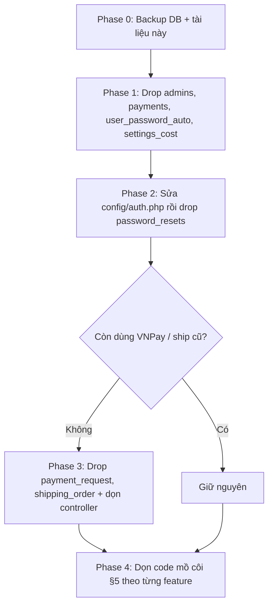

# DB_AUDIT — Rà soát bảng thừa / mồ côi

> **Mục đích:** Xác định bảng nào thừa, bảng nào chỉ còn code mồ côi, và thứ tự dọn an toàn.  
> **Cập nhật:** 2026-07-10 · DB `vattunnongnghiep58` (MySQL) · Laravel **13**  
> **Nguồn:** `database-schema`, `database-query` (read-only), Grep model/controller.

**Liên quan:** [TABLE_GLOSSARY.md](TABLE_GLOSSARY.md) · [MASTER.md](../MASTER.md) · [CHANGE_LOG.md](CHANGE_LOG.md)

> **QUAN TRỌNG:** Theo rule dự án — **không drop bảng khi chưa có backup + xác nhận rõ ràng**. File này chỉ **phân tích & đề xuất**, chưa thực thi drop.

---

## 1. Tổng quan (**35 bảng** sau cleanup 2026-07-10)

| Nhóm                      | Số bảng | Hành động                              |
| ------------------------- | ------- | -------------------------------------- |
| Nghiệp vụ chính           | 28      | **Giữ**                                |
| Hạ tầng Laravel           | 7       | **Giữ**                                |
| Legacy / thừa             | 0       | **Đã drop** (xem §4)                   |
| Bảng thiếu (code còn trỏ) | ~10     | **Phase 4 đã xử lý phần lớn** (xem §5) |

---

## 2. Sự thật đã xác minh (read-only query)

| Kiểm tra                                                                                                                                                                                                                                                                                                                                           | Kết quả                                              |
| -------------------------------------------------------------------------------------------------------------------------------------------------------------------------------------------------------------------------------------------------------------------------------------------------------------------------------------------------- | ---------------------------------------------------- |
| `admins`                                                                                                                                                                                                                                                                                                                                           | 1 row: `admin@local` (username `admin`, level 99999) |
| `users` có admin tương ứng?                                                                                                                                                                                                                                                                                                                        | **Có** — id 51 `admin@local`, role `administrator`   |
| → Kết luận `admins`                                                                                                                                                                                                                                                                                                                                | **An toàn drop** — auth chạy từ `users`              |
| `subscription`, `wishlist`, `discount_code`, `rating_product`, `sponser`, `theme`, `category_theme`, `join_category_theme`, `user_register_email`, `province`, `district`, `ward`, `street`, `orders`, `jt_address`, `shop_product_category`, `contact_payment`, `variable_theme`, `theme_info`, `discount_for_brand`, `check_product_limit_event` | **Không tồn tại trong DB** — chỉ còn model/code      |

---

## 3. Bảng đang dùng — KHÔNG xóa

`users`, `roles`, `permissions`, `role_user`, `permission_role`,
`products`, `categories`, `product_categories`, `product_prices`,
`shop_orders`, `shop_order_items`, `shop_order_status`, `shop_order_payment_status`,
`shop_currencies`, `shop_payment_method`,
`pages`, `contacts`, `email_templates`, `settings`,
`menus`, `menu_items`, `admin_menus`,
`albums`, `album_items`, `media_files`,
`countries`, `customer_forget_pass_otp`, `import_log`.

**Hạ tầng (giữ):** `migrations`, `cache`, `cache_locks`, `sessions`, `jobs`, `failed_jobs`, `password_reset_tokens`.

---

## 4. DROP đã thực hiện (2026-07-10)

Migration `2026_07_09_194029_drop_legacy_admin_and_payment_tables` + user đã backup trước:

| Bảng                 | Trạng thái                                                |
| -------------------- | --------------------------------------------------------- |
| `admins`             | **Dropped**                                               |
| `payments`           | **Dropped**                                               |
| `payment_request`    | **Dropped**                                               |
| `user_password_auto` | **Dropped**                                               |
| `settings_cost`      | **Dropped**                                               |
| `password_resets`    | **Dropped** (`config/auth.php` → `password_reset_tokens`) |
| `shipping_order`     | **Dropped**                                               |

Route VNPay comment: `customer.vnpay`, `customer.payment.point`.

> `failed_jobs` nếu muốn dọn → **truncate**, không drop.

---

## 5. Code mồ côi (bảng KHÔNG tồn tại — code vẫn trỏ tới)

Đây là **nợ kỹ thuật**, không phải bảng thừa. Chạm route/AJAX tương ứng sẽ lỗi SQL.

| Bảng thiếu                                                         | Nơi tham chiếu chính                                                                        | Ghi chú                                       |
| ------------------------------------------------------------------ | ------------------------------------------------------------------------------------------- | --------------------------------------------- |
| `subscription`                                                     | ~~`CustomerController@subscription`~~ → `contacts`                                          | ✅ **Đã sửa** Phase 4                         |
| `wishlist`                                                         | `AjaxController`, `CustomerController`, `Frontend\Product`                                  | `wishlist()` empty state — không query DB     |
| `discount_code`                                                    | `AjaxController` (nhiều phần comment)                                                       | Mã giảm giá không hoạt động                   |
| `rating_product`                                                   | `HomeController`                                                                            | Đánh giá SP                                   |
| `sponser`                                                          | `HomeController@... Sponser::`                                                              | Nhà tài trợ                                   |
| `theme`, `category_theme`, `join_category_theme`, `variable_theme` | `system.php`, `AjaxController`, `SitemapController`, ~~`backend/product/filter.blade.php`~~ | Theme builder cũ — filter SP đã bỏ join theme |
| `user_register_email`                                              | `HomeController@... User_register_email::`                                                  | Log email đăng ký                             |
| `contact_payment`                                                  | `CheckoutController`                                                                        | Liên hệ thanh toán                            |
| `province`, `district`, `ward`, `street`                           | `AjaxController` (có `Schema::hasTable` → fail êm)                                          | Địa chỉ VN                                    |
| `orders`                                                           | `Backend\Orders` model                                                                      | **Không ai gọi** — model chết                 |
| `jt_address`, `shop_product_category`                              | Model only                                                                                  | Model chết                                    |

**Hướng xử lý (chọn 1 mỗi feature):** dọn code (nếu bỏ tính năng) **hoặc** tạo lại bảng (nếu còn cần).

---

## 6. Thứ tự dọn an toàn (đề xuất)

| Phase | Nội dung                                                | Trạng thái           |
| ----- | ------------------------------------------------------- | -------------------- |
| 0     | Backup + doc                                            | ✅ Done              |
| 1–3   | Drop 7 bảng legacy + auth config + comment VNPay routes | ✅ Done (2026-07-10) |
| 4     | Dọn code mồ côi §5                                      | ✅ Done (2026-07-10) |

---

## 7. Cách thực thi (khi được duyệt)

- **Backup:** `mysqldump vattunnongnghiep58 > backup_YYYYMMDD.sql`
- **Drop:** tạo **migration mới** `php artisan make:migration drop_legacy_tables_phase1` — dùng `Schema::dropIfExists()`, kèm `down()` tạo lại cấu trúc.
- **Không** sửa migration cũ. **Không** drop trực tiếp bằng SQL tay.
- Sau mỗi phase: `php artisan test --compact` + smoke các route liên quan.

---

## 8. Lịch sử

| Ngày       | Thay đổi                                                                        |
| ---------- | ------------------------------------------------------------------------------- |
| 2026-07-10 | Sync 35 bảng; Phase 4 done; subscription→contacts; link REFACTOR_3NONG_PLAYBOOK |
| 2026-07-10 | Tạo DB_AUDIT.md — verify `admins`/`users`, phân loại 42 bảng + code mồ côi      |
