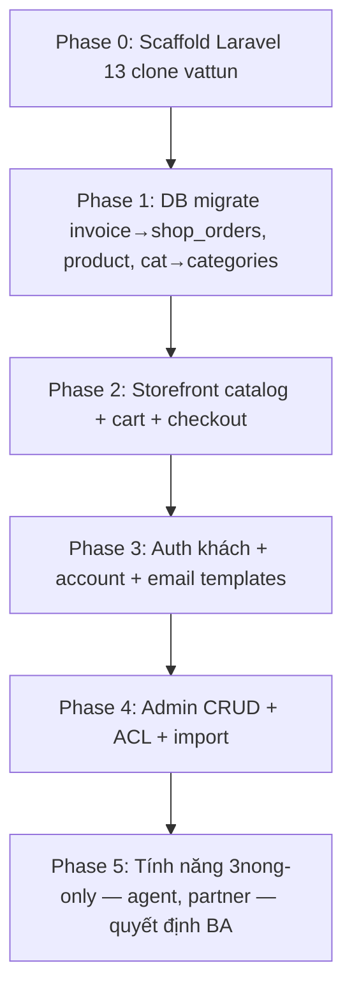

# REFACTOR_3NONG_PLAYBOOK — Port `3nong` theo chuẩn `vattunongnghiep58`

> **Mục đích:** Kế hoạch migrate / build lại `e:\web\3nong` (legacy PHP) theo chuẩn kỹ thuật & nghiệp vụ của `vattunongnghiep58` (Laravel 13).  
> **Cập nhật:** 2026-07-10 · **Chuẩn tham chiếu:** [MASTER.md](../MASTER.md)

**Đọc song song:** [TABLE_GLOSSARY.md](TABLE_GLOSSARY.md) · [ROUTE_GLOSSARY.md](ROUTE_GLOSSARY.md) · [DB_AUDIT.md](DB_AUDIT.md) · [CUSTOMER_ACCOUNT_PLAYBOOK.md](CUSTOMER_ACCOUNT_PLAYBOOK.md) · `e:\web\3nong\ai-context\database\LEGACY_TO_LARAVEL.md`

---

## 1. Tóm tắt chênh lệch

| Hạng mục          | `3nong` (hiện tại)                      | `vattunongnghiep58` (chuẩn)                            |
| ----------------- | --------------------------------------- | ------------------------------------------------------ |
| Stack             | PHP thuần + MySQLi, `?module=` routing  | Laravel **13**, PHP **8.3+**, Pest                     |
| Frontend          | Bootstrap 4, `public/assets/js/main.js` | Vite 7, Tailwind 4, axios (`http.js`, `auth-forms.js`) |
| Admin             | SmartAdmin / Bootstrap 3                | AdminLTE 4, `js_admin.js`, `AdminRoutes`               |
| Auth admin        | Bảng `user`, session PHP                | Bảng `users`, guard `admin`, RBAC                      |
| Auth khách        | Không có đăng nhập storefront           | `/auth/*`, `/account/*`, guard `web`                   |
| Đơn hàng          | `invoice` + `invoiceproduct`            | `shop_orders` + `shop_order_items` (PK `cart_id`)      |
| Bài viết / trang  | `post` + `article` riêng                | `pages` + `type` (`page` / `post`)                     |
| Danh mục          | `cat` đa loại (product/post/photo/link) | `categories` + `product_categories` pivot              |
| Newsletter        | —                                       | `contacts` với `type=subscription`                     |
| Thanh toán online | —                                       | PayPal/VNPay **tắt** (checkout offline)                |
| Test              | Không có                                | **192 passed**, 2 skipped                              |

---

## 2. Thứ tự port (khuyến nghị)



| Phase | Nội dung                                        | Chuẩn vattun                                | Ghi chú 3nong                              |
| ----- | ----------------------------------------------- | ------------------------------------------- | ------------------------------------------ |
| **0** | Clone cấu trúc repo, `.env`, Vite, test harness | `README.md`, `AGENTS.md`                    | Không copy legacy `index.php`              |
| **1** | Schema + seed dữ liệu                           | `TABLE_GLOSSARY.md` §3                      | Map `invoice`→`shop_orders` (xem §3)       |
| **2** | Storefront                                      | `MASTER.md` §3.1–3.2                        | Giữ URL SEO `/product/{slug}-{id}.html`    |
| **3** | Tài khoản khách                                 | `CUSTOMER_ACCOUNT_PLAYBOOK.md`              | **Mới** so với 3nong guest-only            |
| **4** | Admin                                           | `MASTER.md` §3.4, `ROUTE_GLOSSARY.md` §8–11 | RBAC thay quyền cứng                       |
| **5** | Optional                                        | —                                           | `agent`, `partner`, email marketing legacy |

---

## 3. Ánh xạ bảng (legacy 3nong → chuẩn vattun)

| 3nong (legacy)          | vattun (chuẩn)                        | Model                | Ghi chú                                                |
| ----------------------- | ------------------------------------- | -------------------- | ------------------------------------------------------ |
| `invoice`               | `shop_orders`                         | `Frontend\Order`     | PK `cart_id`, không `id`                               |
| `invoiceproduct`        | `shop_order_items`                    | `Frontend\OrderItem` | Cột `quanlity` → `quanlity` (giữ typo legacy trong DB) |
| `product`               | `products`                            | `Frontend\Product`   | Thêm `product_prices` nếu cần biến thể                 |
| `cat` (type product)    | `categories` + `product_categories`   | `Category`, pivot    | Tách type thay vì `cat` đa năng                        |
| `post`                  | `pages` (`type=post`)                 | `Frontend\Page`      | URL `/news/*`                                          |
| `article`               | `pages` (`type=page`)                 | `Frontend\Page`      | Trang tĩnh footer/CMS                                  |
| `slide`                 | `albums` + `album_items` hoặc `pages` | Tùy UI               | vattun dùng album admin                                |
| `contact`               | `contacts`                            | `Contact`            | Form liên hệ                                           |
| `user` (admin)          | `users` + `roles`                     | `Backend\User`       | MD5 → bcrypt khi login                                 |
| `customer`              | `users` (guard `web`)                 | `Frontend\User`      | **Không** tách bảng `customer`                         |
| `setting`               | `settings`                            | `Setting`            | Key-value theme                                        |
| `rate`                  | — (low-use)                           | —                    | Cân nhắc bỏ hoặc port sau                              |
| `agent`                 | —                                     | —                    | **3nong-only** — module mới nếu cần                    |
| `email`, `emailsend`, … | `email_templates`                     | `EmailTemplate`      | Bỏ hệ email marketing cũ                               |
| `partner`, `photo`      | —                                     | —                    | LEGACY — xác nhận BA trước khi port                    |

**Bảng đã drop ở vattun (không port):** `admins`, `payments`, `payment_request`, `password_resets`, `subscription` (dùng `contacts`), `theme*`, `wishlist` — xem [DB_AUDIT.md](DB_AUDIT.md).

---

## 4. Ánh xạ route / URL

| 3nong (ước lượng) | vattun (chuẩn)                          | Route name                      |
| ----------------- | --------------------------------------- | ------------------------------- |
| Trang chủ         | `/`                                     | `index`                         |
| Sản phẩm          | `/product`, `/product/{slug}-{id}.html` | `product`, `product.detail`     |
| Tin tức           | `/news`, `/news/{slug}-{id}.html`       | `news`, `news.detail`           |
| Giỏ / đặt hàng    | `/cart`, `/checkout`                    | `cart`, `cart.checkout`         |
| Đăng nhập khách   | `/auth/login`                           | `customer.login`                |
| Tài khoản         | `/account/*`                            | `customer.*`                    |
| Admin             | `/admin/*`                              | `admin.*`                       |
| Newsletter        | `POST /subscription`                    | `subscription` → lưu `contacts` |

**Redirect 301 (vattun đã có):** `/customer/*` → `/account/*` — áp dụng tương tự nếu 3nong có URL cũ.

**JS route map (bắt buộc khi port frontend):**

- Storefront: `resources/views/frontend/layouts/app-routes.blade.php` → `window.AppRoutes`
- Admin: `resources/views/backend/layouts/admin-routes.blade.php` → `window.AdminRoutes`
- HTTP client: `resources/js/http.js` (không dùng `$.ajax` trong app code)

---

## 5. Tính năng: port / bỏ / quyết định

### 5.1. Bắt buộc port (P0–P1)

- [ ] Catalog sản phẩm + danh mục
- [ ] Giỏ hàng session + checkout offline → `shop_orders`
- [ ] Form liên hệ + email admin
- [ ] Admin: product, order, post, page, contact
- [ ] CSRF (`PreventRequestForgery`), RBAC admin
- [ ] Đăng ký / đăng nhập khách + xem đơn (`/account/orders`)
- [ ] Email template theo `code` (`EmailTemplateCodes`)

### 5.2. Không port (trừ khi BA yêu cầu)

- [ ] PayPal / VNPay / ví điện tử (`PaymentController` — route đã comment)
- [ ] Theme builder (`theme`, `category_theme`)
- [ ] Wishlist, wallet, tin đăng khách (`customer.post` → redirect dashboard)
- [ ] Email marketing 6 bảng legacy 3nong

### 5.3. 3nong-only — hỏi BA trước

- [ ] Đăng ký đại lý (`agent`, `agent.php`)
- [ ] `partner`, `photo` gallery riêng
- [ ] Đánh giá SP theo IP (`rate`)

---

## 6. Checklist chất lượng (parity với vattun)

```bash
# Trên repo 3nong sau khi scaffold Laravel
php artisan test --compact    # mục tiêu: feature parity từng phase
pnpm run build
php artisan migrate --force   # môi trường mới
```

| Test vattun (copy/adapt)     | Phase                     |
| ---------------------------- | ------------------------- |
| `CustomerAuthFlowTest`       | 3                         |
| `CustomerOrderOwnershipTest` | 2–3                       |
| `CsrfProtectionTest`         | 0                         |
| `AdminAclFeatureTest`        | 4                         |
| `RouteAliasTest`             | 2                         |
| `OrphanLegacyCodeTest`       | 1 (không tạo bảng mồ côi) |

**Mục tiêu hiện tại vattun:** 192 passed, 2 skipped (756 assertions).

---

## 7. Tài liệu cần có trên repo 3nong (sau scaffold)

| File                     | Nguồn                                         |
| ------------------------ | --------------------------------------------- |
| `MASTER.md`              | Adapt từ vattun — điền domain/branding 3nong  |
| `docs/TABLE_GLOSSARY.md` | Copy + sửa mapping legacy                     |
| `docs/ROUTE_GLOSSARY.md` | Copy sau khi route ổn định                    |
| `docs/CHANGE_LOG.md`     | Ghi từng phase migrate                        |
| `AGENTS.md`              | Copy từ vattun                                |
| `ai-context/`            | Giữ làm lịch sử legacy; không override MASTER |

**Quy tắc living doc:** Sau mỗi phase migrate → cập nhật `CHANGE_LOG.md` + glossary nếu đổi schema/route.

---

## 8. Lịch sử

| Ngày       | Thay đổi                                                                |
| ---------- | ----------------------------------------------------------------------- |
| 2026-07-10 | Tạo playbook — chuẩn bị port 3nong sau DB cleanup + Phase 4 orphan code |
